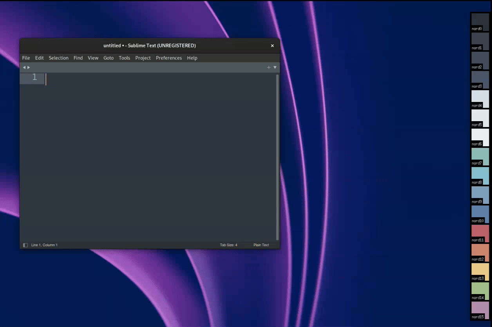

#  Arctic Nord Dock

Arctic Nord Dock is a lightweight dock for Linux environments that allows you to quickly copy palette values in various formats. It is inspired by the [Arctic Color Palette](https://www.nordtheme.com/).

Right-clicking any color box opens a context menu where you can select the desired format (e.g., HTML HEX, CSS RGB, etc.). Once a format is selected, left-clicking any color box copies its value in that format. Despite using X11 internally, it works on Wayland as well.

## Demo



## Installation

### 1. Clone the Repository

```bash
cd /tmp
git clone https://github.com/michaelknap/arctic-nord-dock-x11.git
cd arctic-nord-dock-x11
```
### 2. Build the Project

By default, the project is built with clang. To build, run:
```
make
```
You can override the default compiler by setting the `CC` variable. For example, to use GCC:
```
make CC=gcc
```
### 3. Install the Application

By default, the binary installs to `/opt/arctic-nord-dock`. To install with the default options, run:
```
sudo make install
```
To change the installation directory, override the `PREFIX` variable. For example, to install in `/usr/local`.
Check `Makefile` for other options.

## License
This project is licensed under the MIT License. See the [LICENSE](LICENSE) file for details.
